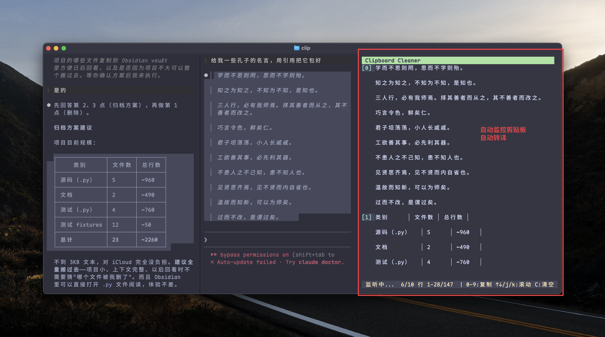

# Clipboard Cleaner

[English](README.md) · **中文**

> macOS 终端剪贴板清洗面板 — 把 Claude Code / Ghostty 复制出来的文本，自动整理成可以直接粘到 IM、笔记、PR 评论的干净格式。



## 这是为了解决谁的痛？

如果你正在使用 [Claude Code](https://claude.com/claude-code) CLI，你大概率被这个 bug 折磨过：**Claude Code 会在终端输出的每一行加上 2 空格缩进 + 在 ~80 字符处硬换行**——这些"格式伪影"会跟着剪贴板被复制走。

这是社区已知的 bug：[anthropics/claude-code#15199](https://github.com/anthropics/claude-code/issues/15199)，多个相关 issue 累计上百个赞，但官方还未修复。

**全球开发者反复踩坑的场景**：

| 场景 | 痛点 |
|---|---|
| 粘贴到 **Slack / Discord** | 虽然支持 Markdown，但硬换行会让代码块在窄屏下完全错乱 |
| 粘贴到 **GitHub PR / Issue 评论** | 一堆 `>` 引用竖线和多余空格被带进去，显得很不专业 |
| 粘贴回**终端执行命令** | 长命令被硬换行截断成两行，运行直接报错 |
| 粘贴到 **Notion / Obsidian** | 2 空格缩进被笔记软件误判为"代码块"或"引用块"，排版完全坏掉 |
| 粘贴到 **微信 / 飞书 / 钉钉** | 这些 IM **不渲染 Markdown**，所有 `**`、`` ` ``、`##` 都是字面字符，丑且难读 |
| 粘贴到 **VSCode** | 每次都要 Select All → Shift+Tab 手动去缩进 |

社区里有零碎的应对办法，比如往 `CLAUDE.md` 加 prompt 教 Claude "用 `\` 续行"——但这要**消耗 token**，每次会话都要付一次。

## 这个工具怎么解决

1. **后台守护**：进程常驻一个 Ghostty pane，每 0.2s 轮询系统剪贴板
2. **自动捕获**：检测到 Claude Code / 终端格式痕迹（硬换行、缩进、引用竖线）才进面板，普通短文本不打扰
3. **保守清洗**：去硬换行、剥引用装饰、还原缩进、删 ASCII 边框，但**不破坏代码块、列表、表格的内部结构**
4. **行内 Markdown 装饰转换**（针对不渲染 Markdown 的 IM）：

   | 原始 | 清洗后 |
   |---|---|
   | `` `code` `` | `「code」` |
   | `**加粗**` | `【加粗】` |
   | `*斜体*` | `斜体` |
   | `[文字](url)` | `文字 (url)` |
   | `## 标题` | `【标题】` |
   | ` ```围栏``` ` | 围栏行去除，代码内容保留 |
   | Markdown 表格 | 数字条目列表 |
   | Box-drawing 表格 `┌─┬─┐` | 同上，转条目 |
   | YAML front-matter | 去除 |
   | 水平分割线 `---` | 去除 |
   | Obsidian callout `[!tip]` | 标签 → `【标签】` 独立成行 |

5. **历史面板**：保留最近 10 条清洗结果，按数字键 `0-9` 复制

完整规则见 [`docs/CLEANING_RULES.md`](docs/CLEANING_RULES.md)。

## 演示

**输入**（从 Claude Code 复制）：

```
  ## 步骤

  请使用 `git commit` 提交，并 **不要** 跳过 hooks。
  详见 [文档](https://git-scm.com)。
```

**输出**（粘到微信里）：

```
【步骤】

请使用 「git commit」 提交，并 【不要】 跳过 hooks。
详见 文档 (https://git-scm.com)。
```

## 安装

```bash
git clone https://github.com/manwithshit/clipboard-cleaner.git
cd clipboard-cleaner
pip3 install pyperclip wcwidth
```

依赖：

- Python 3.9+
- macOS（依赖 `pbpaste`，跨平台未测试）
- 推荐在 [Ghostty](https://ghostty.org/) 终端的 split pane 中运行

## 使用

### TUI 模式（推荐）

```bash
python3 run.py
```

界面：

```
┌──────────────────────────────┐
│  Clipboard Cleaner           │
├──────────────────────────────┤
│ [0] 最新清洗结果...           │
│ [1] 上一条...                │
│ ...                          │
│ [9] 最旧的...                │
├──────────────────────────────┤
│ 监听中... 3/10               │
│ 0-9:复制 ↑↓:滚动 C:清空 q:退出│
└──────────────────────────────┘
```

| 按键 | 行为 |
|---|---|
| `0` ~ `9` | 复制对应条目到系统剪贴板 |
| `↑` / `k` | 向上滚动 |
| `↓` / `j` | 向下滚动 |
| `PageUp` / `PageDown` | 按页滚动 |
| `Home` / `End` | 跳到顶部 / 底部 |
| `C` | 清空面板 |
| `q` | 退出 |

### 纯文本模式（pipe 测试）

```bash
echo '  缩进的 **加粗** 文本' | python3 run.py --plain
```

### 推荐别名

在 `~/.zshrc` 加：

```bash
alias clip='cd /path/to/clipboard-cleaner && python3 run.py'
```

## 设计原则

**保守清洗，少误伤。** 默认不破坏列表、代码块、表格的内部结构，只修复确定性强的问题。

**IM 视觉等价。** 转换 Markdown 标记时，目标是"在不渲染 Markdown 的环境里读起来仍然有视觉强调"，而不是"语义无损的转换"。所以 `**bold**` → `【bold】` 是合理的，反过来不一定。

**幽灵捕获过滤。** 没有任何 Claude Code / 终端格式痕迹的文本（语音输入、其他应用复制的干净文本）会被跳过，不进面板。

## 架构

```
┌──────────────────┐    ┌─────────────────┐    ┌─────────────┐
│ pyperclip 轮询    │──▶│ has_format_     │──▶│ clean()     │
│ (0.2s)           │    │ artifacts() 过滤 │    │ 7 步管线    │
└──────────────────┘    └─────────────────┘    └──────┬──────┘
                                                     │ queue
                                                     ▼
                       ┌─────────────────┐    ┌─────────────┐
                       │ AppState        │◀──│ curses TUI   │
                       │ 历史 10 条       │    │ 数字键复制    │
                       └─────────────────┘    └─────────────┘
```

详见 [docs/TECHNICAL_DESIGN.md](docs/TECHNICAL_DESIGN.md)。

## 测试

```bash
python3 -m pytest tests/ -v
```

包含 109 个单元测试 + 6 组 golden fixture，覆盖所有清洗规则的常见和边界场景。

## 已知限制

1. 0.2s 轮询间隔内连续复制 A 再复制 B，只能看到 B
2. 没有任何格式痕迹的极短 Claude 输出会被 `has_format_artifacts` 跳过（设计取舍：宁愿漏，不要误捕获语音输入）
3. macOS only — Windows / Linux 未测试

## License

MIT
